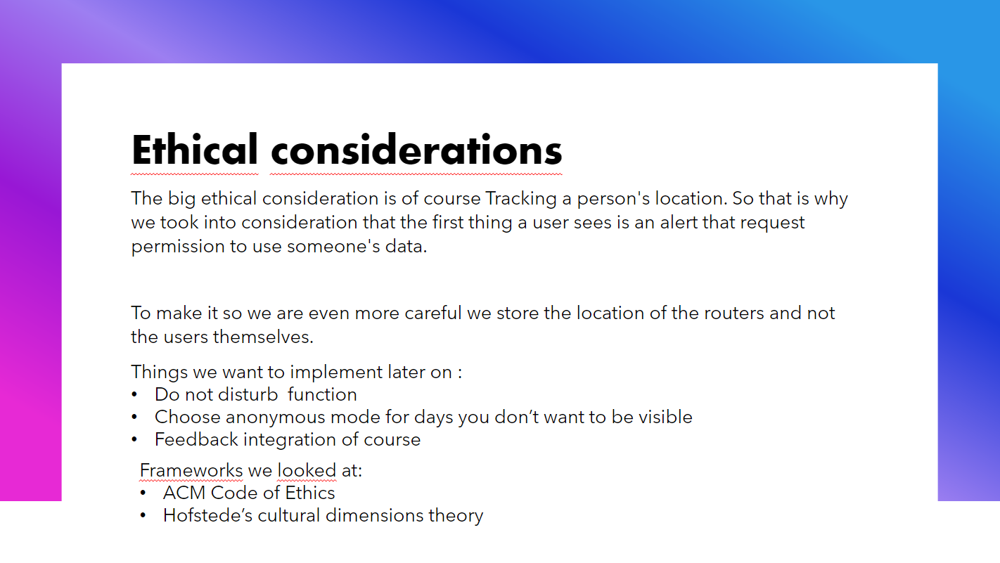
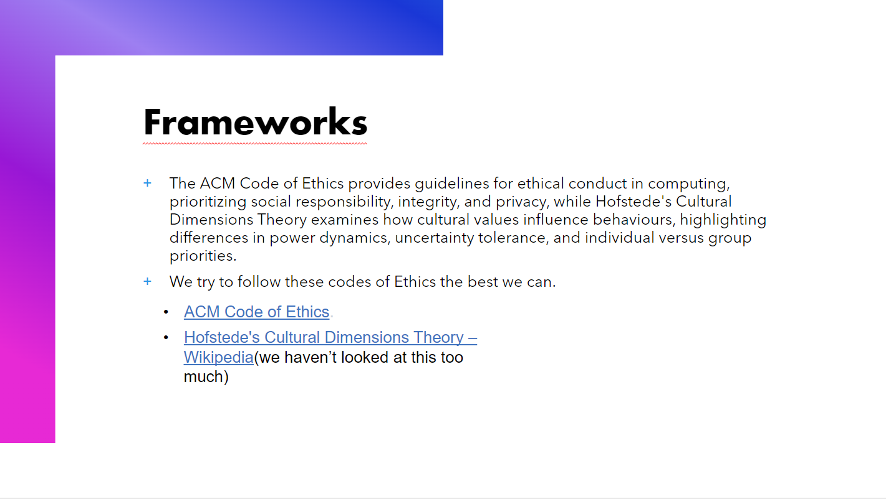
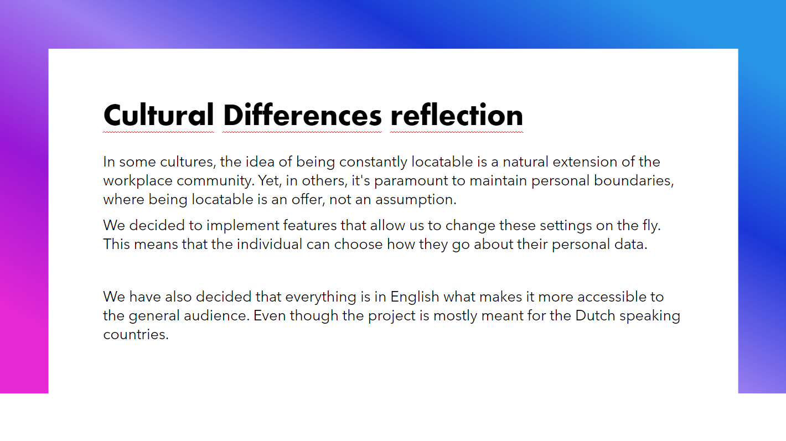

# Cultural differences and ethics
>You recognize and take into account cultural differences between project stakeholders and ethical aspects in software development.
>
>**Recognize:** Recognition is based on theoretically substantiated awareness of cultural differences and ethical aspects in software engineering. 
>
>**Take into account:** Adapt your communication, working, and behavior styles to reflect project stakeholders from different cultures;
>
>Address one of the standard Programming Ethical Guidelines (e.g., ACM Code of Ethics and Professional Conduct) in your work.
>[^1]

## **Table of Contents**
- [What are ethics and cultural differences in software development?](#what-are-ethics-and-cultural-differences-in-software-development)
- [Why ethics and cultural differences are important.](#why-ethics-and-cultural-differences-are-important)
- [How we address ethical concerns and cultural differences.](#how-we-address-ethical-concerns-and-cultural-differences)
- [Sources](#sources)

# **What are ethics and cultural differences in software development?**
Software exists to solve problems and make things easier or more accessible. Solving problems for one group can cause them for another though. That's where ethics and cultural differences come into play.   
When someone makes a program that's intended to help people with their finances, it can also open up risks of exploitation by bad actors. When someone makes a change that's meant to improve security by adding a minimum length to fields such as names or addresses, it could unintentionally exclude cultures that have shorter names, or symbols that don't follow the Roman alphabet. When teamwork is limited to certain hours, but not every teammember shares a timezone, it can make communication extremely difficult and limited.  
These issues, and ones like it, are examples of the role ethics and cultural differences can play in your software and the development of it. 
[^2]
[^3]

# **Why ethics and cultural differences are important.**
Ethics and cultural differences can affect every part of your application. By not taking them into account properly, you exclude a part of the world from using or working on your application for arbitrary reasons at best, but extreme negligence can lead to endangering your users by exposing them to unnecessary risks of exploitation through not keeping their privacy and safety in mind properly while creating your application.   
These risks, and everything inbetween, are why ethics and cultural differences need to be kept in mind throughout the entire process of creating an application, to ensure the application benefits society at large instead of harming it and development can run smoothly even with a diverse team.
[^2]
[^3]

# **How we address ethical concerns and cultural differences.**
In different parts of the world, different standards exist, so to make this document as easily available and readable as possible we chose to make it in markdown, as this is a format that can be read by most browsers and text editors without needing to change it in any way, and it can also easily be transformed into html to restore its layout.

Additionally, within our group project we have made a presentation that included details regarding a few different learning outcomes, including this one. Below you can see the slides that are relevant to this outcome.

This slide discusses ethical considerations we made and planned to implement. As our group project focused on tracking user locations it was essential that we treat their privacy very carefully as to not overstep their boundaries or put our users at risk.

Here, we discussed the frameworks we used to draw certain conclusions regarding ethical aspects we wanted to take into consideration for our application.

Lastly, we discussed potential cultural differences that could arise regarding our userbase and what actions we take to ensure users of various cultures can comfortably and easily use our application.
[^3]
[^4]

---
### **Sources**
[^1]: Canvas. (n.d.). Canvas outcomes. Retrieved october 4th, 2023, from https://fhict.instructure.com/courses/13181/outcomes  
[^2]: Mishra, A., Mishra, D. (2014). Cultural Issues in Distributed Software Development: A Review. In: Meersman, R., et al. On the Move to Meaningful Internet Systems: OTM 2014 Workshops. OTM 2014. Lecture Notes in Computer Science, vol 8842. Springer, Berlin, Heidelberg. Retrieved october 4th, 2023, from https://doi.org/10.1007/978-3-662-45550-0_45 
[^3]: Association for Computing Machinery. (2018). ACM Code of Ethics and Professional Conduct. Retrieved october 4th, 2023, from https://www.acm.org/code-of-ethics 
[^4]: Wikipedia contributors. (2023, November 27). Hofstede’s cultural dimensions theory. Wikipedia. https://en.wikipedia.org/wiki/Hofstede%27s_cultural_dimensions_theory 