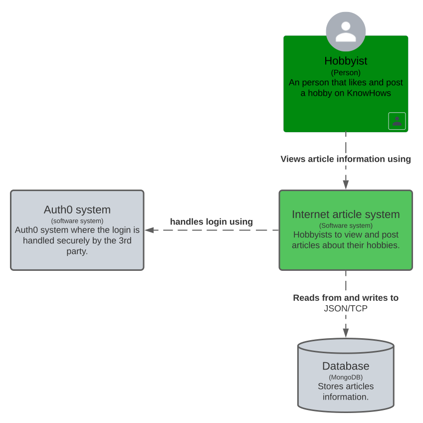
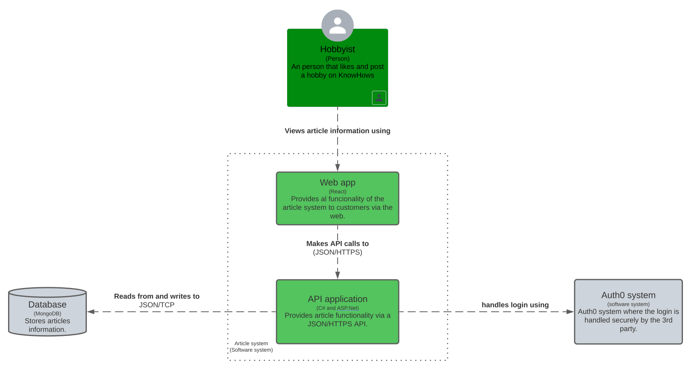
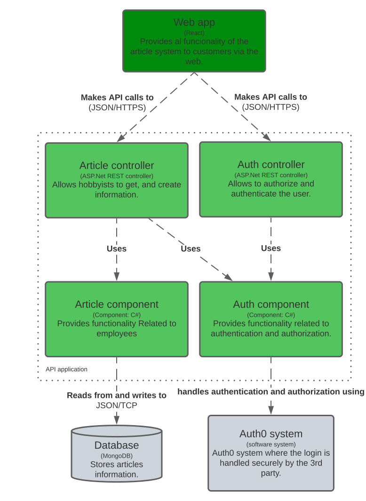

# Requirements and design
>You analyze (non-functional) requirements, elaborate (architectural) designs and validate them using multiple types of test techniques.
>
>**Multiple types of test techniques:** You apply user acceptance testing and stakeholder feedback to validate the quality of the requirements. You evaluate the quality of the design (e.g., by testing or prototyping) taking into account the formulated quality properties like security and performance.

## **Table of Contents**
- [What are requirements and designs?](#what-are-requirements-and-designs)
- [Why we use requirements and designs.](#why-we-use-requirements-and-designs)
- [How we use requirements and designs.](#how-we-use-requirements-and-designs)
- [Sources](#sources)

# **What are requirements, designs and tests?**
Requirements and designs are like the blueprints for a project, sometimes quite literally. They serve as a guide to how an application should look from various aspects, such as a design for the pages themselves, but also the structure of the files that an application is actually composed of, and how those files should interact with one another. Requirements, as the name implies, are usually some form of list of requirements that the application should conform to or achieve. Lastly, tests serve as a way to ensure that the actual program does what it is expected to do, as well as what the requirements ask of it in certain cases.

# **Why we use requirements, designs and tests.**
While requirements, designs and tests are all seperate in their contents and functions, they serve a combined function. They all aim to give the stakeholders and/or end-users the product they asked for.  
Requirements ensure that every party has an agreed upon final vision for the project, with certain features, minimal performance, and other types of requirements. Designs ensure that the intended outcome, as well as the path to get there, are properly documented and visually explained. Tests, lastly, serve as proof that the product truly does what it's said to.  
That's not the only reason to use requirements and designs in particular, though. These two also make it easier for someone else to take over the project, as there's documentation to explain what the product should look like, meaning that negotiations don't need to start over every time a new team starts working on a product.

# **How we use requirements and designs and tests.**
For requirements, we've made a few user stories as well as a few requirements for each user story and a definition of done that fits all user stories. Meanwhile, for tests, we've tested almost every logic function in both back- and front-end to ensure they function properly.
Additionally, we have a few diagrams displaying the general structure which our program adheres to, as is described by the C4 Model.  
  

This is the first level of the model, which shows the various large entities that make up our application as well as its user(s)

This is the second level of the model, which shows a more detailed view that includes the seperate parts that make up the Internet Article System from the previous level.
  

Here, an even more in depth look is given into our application, where the focus lies on the exact structure of our application as well as external systems we interact with.

---
### **Sources**
[^1]: Canvas. (n.d.). Canvas outcomes. Retrieved october 4th, 2023, from https://fhict.instructure.com/courses/13181/outcomes  