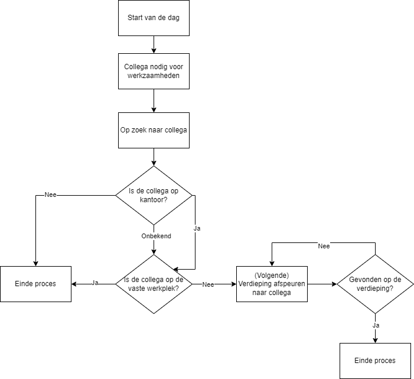
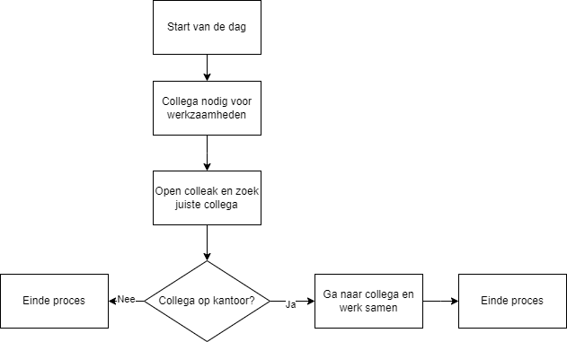

# Business processes
>You analyze and describe simple business processes that are related to your project.
>
>**Simple:** Involving stakeholders, predominantly sequential processes with one or two alternative paths.
>
>**Related:** Business processes during which the software that you are developing will be used (business processes that the software must support by fully or partially automating them). 
>
>*or*
>
>Business processes needed for the success of your software development project (e.g., product release, market release, financial assurance).

## **Table of Contents**
- [What are bussiness processes?](#what-are-bussiness-processes)
- [Why we use business processes.](#why-we-use-business-processes)
- [How we use business processes.](#how-we-use-business-processes)
- [Sources](#sources)

# **What are business processes?**
A business process is an action or sequence thereof with the goal of achieving particular organizational goals and an emphasis on delivering repeatable and deliberate results.  
Business process management (BPM) is a systemic approach used to optimize these processes and assist businesses in achieving their goals. Businesses may turn to business process outsourcing when cost or resource constraints prevent the internal execution of certain processes.  
Monitoring step completion, assessing quality and benchmarking are ways to measure the success of business processes. Organizations can improve a process that isn't meeting objectives by increasing visibility and using techniques like BPM.  
BPM improves overall effectiveness and gives organizations a better understanding of how their business operates by visualizing how processes work.
[^2]

# **Why we use business processes.**
For the following reasons, defined business processes are crucial to an organization's success:

1. **Clarity of Work**: They assist businesses in identifying and understanding what it takes to continue operations and accomplish objectives.

2. **Structured Approach**: These processes divide work into manageable, repeatable steps that employees can use to get results consistently.

3. **Resource Optimization**: By adhering to these repeatable steps, organizations can more accurately predict their resource needs, lowering the chance of using valuable resources excessively or inefficiently.

4. **Risk reduction**: Employees are less likely to introduce workarounds or individualized steps that could interfere with operations, impede progress, or lead to higher error rates because defined processes are consistent.

5. **Efficiency Improvement**: Organizations can assess the efficiency and effectiveness of individual process steps, enabling teams to find and fix bottlenecks and inefficiencies as a basis for ongoing improvement.

6. **Integration of technology**: Teams can identify areas where tools like robotic process automation (RPA) could further improve productivity and effectiveness.

In essence, clearly defined business processes improve an organization's ability to manage resources, reduce risks, increase efficiency, and potentially advance technology.
[^2]

# **How we use business processes.**
While we have not done much regarding business processes in the individual project, in the group project two business processes have been visualized.

The image above shows the process of an employee attempting to find a colleague within their office building, showing that it can be a difficult or lengthy process without any further assistance or knowledge about the whereabouts of said colleague.

This chart displays the process of an employee attempting to find a specific colleague after using the app we developed for it. As can be seen, it is a much simpler and more direct flow with less uncertainty. This displays the usefulness of the application we made with the group project.

---
### **Sources**
[^1]: Canvas. (n.d.). Canvas outcomes. Retrieved october 4th, 2023, from https://fhict.instructure.com/courses/13181/outcomes  
[^2]: Pratt, M. K., Roy, M., McLaughlin, E. (n.d.). Business Processes. Retrieved october 4th, 2023, from https://www.techtarget.com/searchcio/definition/business-process