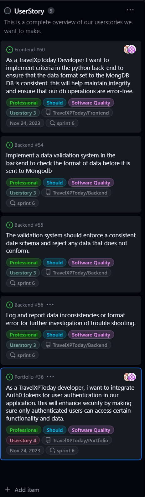
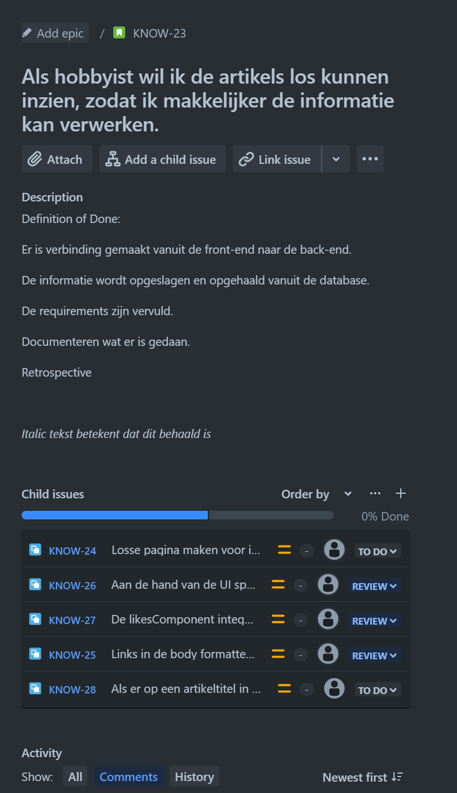

# Introduction

Part of the process of completing this project is about outsourcing a user story or multiple smaller user stories to another group, as well as working on a user story from that group or a different group. This document will detail what we outsourced, what we did for the group that outsourced to us, and a retrospective on the process from both sides.

Table of Contents
- [Userstories TravelXPToday](#userstories-travelxptoday)
- [Userstories Know-Hows](#userstories-know-hows)
- [Outscourcing Know-Hows](#outscourcing-know-hows)
- [Retrospective](#retrospective)
  - [Team TravelXPToday](#team-travelxptoday)
  - [Team Know-Hows](#team-know-hows)
  - [Outsourcing Positives and struggles](#outsourcing-positives-and-struggles)
  - [Lean Meegdes and Jimmy Schuurmans for TravelXPToday](#lean-meegdes-and-jimmy-schuurmans-for-travelxptoday)
- [Sources](#sources)
  
# Userstories TravelXPToday

These are the user stories we worked on for TravelXPToday

As can be seen, the requirements posed for us can be split into two stories. Story 3 was handled by Jimmy, while story 4 was done by Lean. User Story 3 was completed according to the interpretation made by Jimmy, but this did not line up to expectations, while User Story 4 was worked on but could not be finished in time due to problems arising.

# Userstory Know-Hows

Below is the user story and its requirements that was handed off to the team at TravelXPToday, Art and Jelle.

# Outscourcing TravelXPToday

The outsourcing exchange with Art and Jelle was done to analyze whether our process and project were easily understandable by someone without much insider perspective in the application and our workflow. We chose to do a mutual outsourcing as we were at similar points in our project which should make it so the primary problems we'd encounter would be from the project itself, not from a vast difference in complexity. This ended up exposing some differences in how both groups worked, which was very insightful.

# Retrospective

The following Retrospective was written in cooperation by both groups.

**What is SWOT Retrospective?**
The SWOT sprint retrospective assesses the team’s strengths and weaknesses, along with the project’s opportunities and threats. The retrospective is divided into four quadrants:

- **Strengths** are attitudes and behaviors that worked in the past
- **Weaknesses** consist of any attitudes or behaviors that did not work in past projects
- **Opportunities** allow the team to improve
- **Threats** are risks to consider when taking on the project.

## Team TravelXPToday

**Strengths**:
We have been in constant communication, which was productive and not negatively influential.
Divided work nicely what made our schedules line up.

**Weaknesses**:
Should have tried to work better with Jira, instead of drawing our own plan.

**Opportunities**:
write more documentation about what we did. This makes it easier for our companions to understand what we did.

**Threats**:
Don’t do things the companions didn’t asked for. Follow the subtask.

## Team Know-Hows

**Strengths**:
- Each of us worked on a different user story to separate the workload.

**Weaknesses**:
- We only know how to work with a select amount of industry tools.
- We don't always spend enough time on documentation.

**Opportunities**:
- We could spend set amounts of time on documentation to ensure consistent progress.

**Threats**:
- Control the user story and subtask to find missing items, this to disallow the dependency on missing endpoints or components and to halt work progress.

## Outsourcing Positives and struggles

Jelle Manders and Art Nooijen for Know-Hows

- Because of the research that was done for the UI-Spike there was a clear vision for the design. There was only one wireframe which made it guess what should be on the other pages. With the implied design we were still able to implement the other pages.

- Because the front page was minimalistic, it was easy to apply the styles ourselves.

- The front-end code was a little bit messy so it was hard to understand.

- There were missing back-end functions so we weren't able to create the frontend.

- Vision of the project was clear, thanks to the up to date portfolio.

- Jira was clear with clear user stories. I(Art) learned I don't like Jira. Same for me (Jelle). So this was not a problem of the team but the tools used.

## Lean Meegdes and Jimmy Schuurmans for TravelXPToday

Pros:

- It was nice to have the mermaid image when you direct to the default API route, this was good to see if the API was working.
- The code was very easy to understand excluding differences in coding languages.
The user stories in the github project Kanban board were very clear so we could easily find out what was expected from the user story and requirements.

Cons:

- The startup documentation was a bit confusing especially for the back-end.
- When the project is being outsourced, mention what the most up-to-date branch is to branch from.

# Conclusion
Done by both groups:

- Make sure everything is prepared correctly to make it possible to implement the new functions.(github branches/usage instructions)
- Clear user-stories help understand what needs to be done. If the project is still unknown to you. This goes the same for the documentation.
- The way we chose to do this sprint is by going in blind, but if we really outsourced it we would have asked clarification issues and clarified the user stories if needed.

