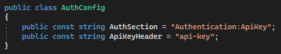
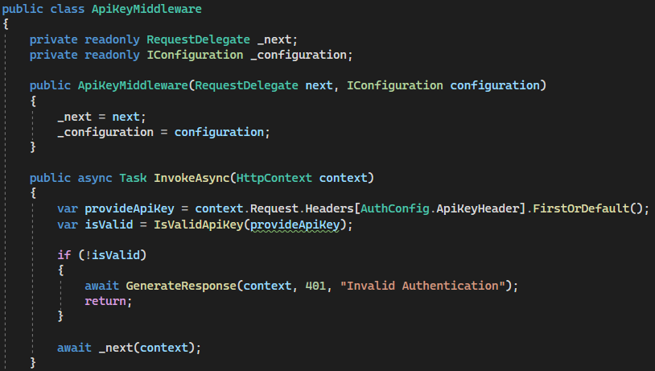
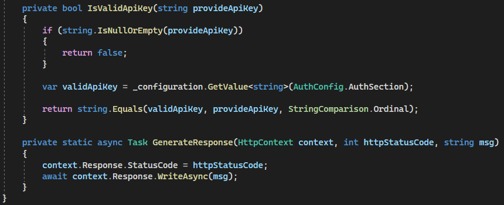
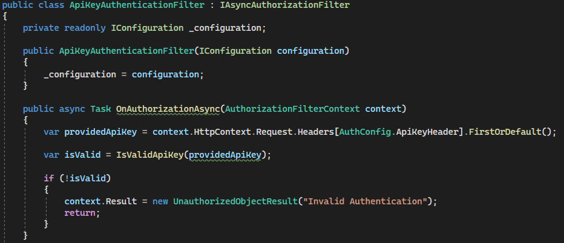
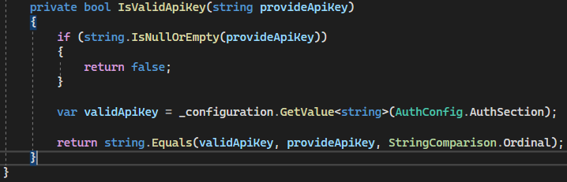

# **Security Spike**

## **Table of Contents**
- [Hoe kan er een beveiligde verbinding worden gemaakt tussen de front-end en back-end?](#hoe-kan-er-een-beveiligde-verbinding-worden-gemaakt-tussen-de-front-end-en-back-end)
    - [Wat is API beveiliging?](#wat-is-api-beveiliging)
        - [API beveiliging uitgelegd.](#api-beveiliging-uitgelegd)
    - [Waarom is API beveiliging belangrijk?](#waarom-is-api-beveiliging-belangrijk)
    - [Welke manieren van beveiliging zijn er?](#welke-manieren-van-beveiliging-zijn-er)
        - [Wat is een API-key?](#wat-is-een-api-key)
        - [Wat is Token gebaseerde authenticatie met Auth0?](#wat-is-token-gebaseerde-authenticatie-met-auth0)
        - [Wat is een JWT?](#wat-is-een-jwt)
    - [Hoe kan ik implementeren dat er een API-key nodig is om verbinding te krijgen met de API?](#hoe-kan-ik-implementeren-dat-er-een-api-key-nodig-is-om-verbinding-te-krijgen-met-de-api)
    - [Hoe kan ik auth0 gebruiken om een token gebaseerde authenticatie te implementeren?](#hoe-kan-ik-auth0-gebruiken-om-een-token-gebaseerde-authenticatie-te-implementeren)
- [Conclusie](#conclusie)

## **Hoe kan er een beveiligde verbinding worden gemaakt tussen de front-end en back-end?**

### **Wat is API beveiliging?**
API beveiliging is de praktijk van het beschermen van de application programming interface (API) tegen aanvallen die kwaadwillig gebruik zouden maken van de API of die zouden proberen deze te misbruiken om gevoelige gegevens te stelen of diensten te verstoren. API beveiliging maakt gebruik van strategieën, technieken en oplossingen om ervoor te zorgen dat alleen geautoriseerde gebruikers toegang hebben tot en gebruik kunnen maken van een API, en dat de gegevens die via de API worden verzonden, beschermd zijn tegen ongeautoriseerde toegang of manipulatie.

[^2]

#### **API beveiliging uitgelegd.**
Omdat API's fungeren als de backend-infrastructuur voor systemen en diensten, is het van cruciaal belang om API's te beveiligen om de gevoelige gegevens die ze overdragen te beschermen, inclusief toegangsinformatie, zoals authenticatie, autorisatie, invoervalidatie en versleuteling. API-beveiliging verwijst naar de methoden en tools die zijn ontworpen om deze backend-infrastructuur te beschermen en aanvallen van toegangsovertredingen, bot-aanvallen en misbruik te verminderen.

Veelvoorkomende soorten API-aanvallen zijn:
- Denial-of-service (DoS) aanval
- Distributed denial-of-service (DDoS) aanval
- Man-in-the-middle (MITM) aanval
- Broken access control aanval
- Injection

Een succesvolle API-aanval kan leiden tot massale gegevensverliezen, gestolen privé- of persoonlijke informatie en verstoring van de dienstverlening.

[^2]

### **Waarom is API beveiliging belangrijk?**
Apps zijn alomtegenwoordig, een integraal onderdeel van het bedrijfsleven en de samenleving. En achter bijna elke app staat een API, waardoor API-beveiliging van cruciaal belang is.

API's dienen als de backend-infrastructuur voor de meeste cloud-native applicaties, waaronder mobiele apps, webapplicaties en SaaS, evenals interne, partner-gerichte en klantgerichte applicaties. Om het gebruik van API's in perspectief te plaatsen, zag Postman, het API-beheerplatform, 1,13 miljard API-oproepen in 2022. Met de opkomst van de API komt natuurlijk een potentieel lucratief aanvalsoppervlak dat kwaadwillende actoren lokt.

Omdat API's applicatielogica, bronnen en gevoelige gegevens blootleggen, inclusief persoonlijk identificeerbare informatie (PII), zijn ze een doelwit geworden voor aanvallers. Als aanvallers toegang krijgen tot onbeschermde API's, kunnen ze bedrijfsprocessen verstoren, toegang krijgen tot of gevoelige gegevens vernietigen en eigendommen stelen.

[^2]

### **Welke manieren van beveiliging zijn er?**
Om een API te beveiligen zijn er verschillende mogelijkheden om uit te kiezen maar de populairdere manieren zijn op dit moment:
- API-key
- Token gebaseerde authenticatie via een 3rd party
- Gebruik maken van JWT's

De laatste 2 lijken heel erg op elkaar omdat het allebei tokens zijn maar ze verschillen toch heel veel van elkaar, met name de implementatie.

#### **Wat is een API-key?**
Een API-key is een code die wordt gebruikt om de toegang tot een API te beheren. Het is een vorm van authenticatie die wordt gebruikt om te controleren of de aanvrager geautoriseerd is om toegang te krijgen tot de API. API-keys worden vaak verstrekt door de beheerder van de API en moeten worden opgenomen in elke API aanvraag om de identiteit van de aanvrager te verifiëren.

API-keys worden vaak gebruikt om beperkte toegang tot een API te bieden, zodat de beheerder kan controleren wie er toegang heeft tot de API en het gebruik ervan kan beheren. Ze worden ook gebruikt om het gebruik van de API te volgen en te beperken, en om ervoor te zorgen dat de API alleen wordt gebruikt door geautoriseerde partijen.

Het is belangrijk om API-sleutels vertrouwelijk te houden en veilig te beheren, omdat ze kunnen worden misbruikt als ze in handen vallen van kwaadwillende partijen. Het is ook raadzaam om regelmatig API-keys te roteren om de beveiliging te handhaven en ongeautoriseerd gebruik te voorkomen.

#### **Wat is Token gebaseerde authenticatie met Auth0?**
Token gebaseerde authenticatie met Auth0 verwijst naar het proces waarbij Auth0 wordt gebruikt als een externe service voor identiteits- en toegangsbeheer in een applicatie of systeem. Auth0 is een populaire Identity-as-a-Service (IDaaS) platform dat ontwikkelaars en bedrijven in staat stelt om veilige, schaalbare en aanpasbare authenticatie- en autorisatie-oplossingen te implementeren.

Bij token-gebaseerde authenticatie met Auth0 doorloopt een gebruiker het volgende proces:

- Een gebruiker vraagt toegang tot een beveiligde bron binnen een applicatie.
- De applicatie stuurt een verificatieverzoek naar Auth0.
- Auth0 verifieert de gebruiker en genereert een token (zoals een JSON Web Token, JWT) dat de identiteit van de gebruiker vertegenwoordigt en de relevante machtigingen bevat.
- Het gegenereerde token wordt naar de applicatie teruggestuurd.
- De applicatie verifieert de geldigheid en authenticiteit van het token. Als het token geldig is, staat de applicatie de gebruiker toe toegang te krijgen tot de aangevraagde bronnen of functionaliteiten.

De voordelen van het gebruik van token-gebaseerde authenticatie met Auth0 zijn onder meer:

- Veiligheid: Auth0 biedt robuuste beveiligingsfuncties, waaronder codering en handhaving van sterke wachtwoordbeleidsregels.
- Schaalbaarheid: Auth0 kan worden geschaald voor zowel kleine als grote gebruikersbases en kan verschillende authenticatiemethoden ondersteunen.
- Aanpasbaarheid: Auth0 kan worden geconfigureerd om aan de specifieke vereisten van een applicatie of bedrijf te voldoen.
- Gemakkelijke integratie: Auth0 kan naadloos worden geïntegreerd met verschillende platforms en frameworks, waardoor ontwikkelaars gemakkelijk beveiligingsfuncties kunnen implementeren in hun applicaties.

Al met al stelt token-gebaseerde authenticatie met Auth0 ontwikkelaars in staat om veilige en betrouwbare gebruikerservaringen te creëren zonder zich zorgen te hoeven maken over de complexiteit van het beheer van authenticatie en autorisatie.

#### **Wat is een JWT?**
JWT staat voor JSON Web Token. Het is een open standaard (RFC 7519) die een compacte en zelfstandige manier biedt om informatie veilig tussen twee partijen te verpakken als een JSON-object. Deze informatie kan worden geverifieerd en vertrouwd omdat deze digitaal is ondertekend. JWT's kunnen worden gebruikt voor verificatie en beveiligde overdracht van claims tussen twee partijen.

Een JWT bestaat uit drie delen, die gescheiden zijn door punten:

- Header: Bevat het type token (JWT) en het gebruikte ondertekeningsalgoritme, zoals HMAC SHA256 of RSA.
- Payload: Ook wel bekend als de claim, bevat de geverifieerde gegevens, zoals de gebruikers-ID of de rol van de gebruiker.
- Signature: Om de integriteit van het bericht te waarborgen, wordt een gecodeerde handtekening gebruikt, die wordt gegenereerd met behulp van de header, het payload en een geheime sleutel. Deze handtekening kan later worden gebruikt om te verifiëren of het bericht niet is gewijzigd.

JWT's worden vaak gebruikt voor het verifiëren van de identiteit van gebruikers tijdens de authenticatie van een gebruiker bij een systeem. Ze worden ook gebruikt voor het veilig verzenden van informatie tussen twee partijen, bijvoorbeeld tussen een server en een client, en worden vaak gebruikt in combinatie met OAuth en andere authenticatieprotocollen.

Een van de belangrijkste voordelen van JWT's is dat ze lichtgewicht zijn en gemakkelijk kunnen worden doorgegeven via URL's, queryparameters of in de header van een HTTP-verzoek. Ze worden vaak gebruikt in moderne webontwikkeling en zijn een populaire keuze geworden voor het implementeren van authenticatie en beveiliging in webapplicaties.

### **Hoe kan ik implementeren dat er een API-key nodig is om verbinding te krijgen met de API?**
Om gebruik te kunnen maken van een API-key in mijn API ben ik websites en tutorial videos af gegaan om een duidelijke, fijn en goede tutorial te vinden om te implementeren van API-keys. Ik heb uiteindelijk een video gevonden die hier wordt gelinkt[^3]. In deze tutorial wordt er gebruik gemaakt van een middleware en een authentication filter. 

De middleware wordt gebruikt voor heel te API, dit betekent dat voor elke endpoint van elke controller een API-key nodig heeft. Door gebruik te maken van de middleware weet je zeker dat er een API-key moet worden meegestuurd met de request, maar dit zorgt natuurlijk voor geen vrijheid van dat je alleen maar voor een paar specifieke controllers of endpoints de API-key hoeft te gebruiken.

De authentication filter zorgt ervoor dat er de vrijheid is om specifieke controllers of endpoints een API-key verwachten in de request. Dit zorgt er dan wel voor dat je overal moet controleren of de verwachte controllers en/of endpoints de authenticcation filter implementeren/toepassen.

**AuthConfig**

In de AuthConfig wordt de naam van de header gedefined waar de API-key instaat en waar de API-key kan worden opgehaald.

**ApiKeyMiddleware**

De ApiKeyMiddleware maakt gebruik van de InvokeAsync functie, deze functie wordt uitgevoerd zodra er een request binnen komt op de API. Hierbij vergelijkt het de meegekregen API-key met de juiste API-key om toegang te krijgen naar de API. Als de API-key niet correct is dan wordt er een 401 response gemaakt met de message "Invalid Authentication".

Als de middleware wordt gebruikt dan is er een API-key nodig voor heel de API en dan kan je niet specifieke controllers of endpoints eisen dat ze de API-key nodig hebben.

**ApiKeyAuthenticationFilter**

De ApiKeyAuthenticationFilter maakt gebruik van een interface genaamd IAsyncAuthorizationFilter, dit zorgt ervoor dat de ApiKeyAuthenticationFilter gebruikt kan worden om voor specifieke controllers of endpoints te vragen om een API-key. Als de API-key niet correct is dan wordt er een 401 response gemaakt met de message "Invalid Authentication".

Als de AuthenticationFilter wordt gebruikt dan moet je bij elke controller of endpoint neerzetten dat er gebruik moet worden gemaakt van de filter. Hierdoor moet er goed gecontroleerd worden of de filter wordt gebruik waar het ook bedoeld is om de filter te gebruiken.

### **Hoe kan ik auth0 gebruiken om een token gebaseerde authenticatie te implementeren?**

## **Conclusie**

----------------
### **Sources**
[^1]: Leo Bekhuis. (n.d.) De beste manier om security in te richten binnen je API gateway. Retrieved november 1, 2023, from https://emagiz.com/blogs/de-beste-manier-om-security-in-te-richten-binnen-je-api-gateway/  
[^2]: paloalto networks. (n.d.) What Is API Security? Retrieved november 1, 2023, from https://www.paloaltonetworks.com/cyberpedia/what-is-api-security  
[^3]: Mohamad Lawand. (october 22, 2023) API Security: A Comprehensive Guide to Safeguarding Your APIs with API Keys. Retrieved november 1, 2023, from https://www.youtube.com/watch?v=XabkK84CKI8&t=452s  
