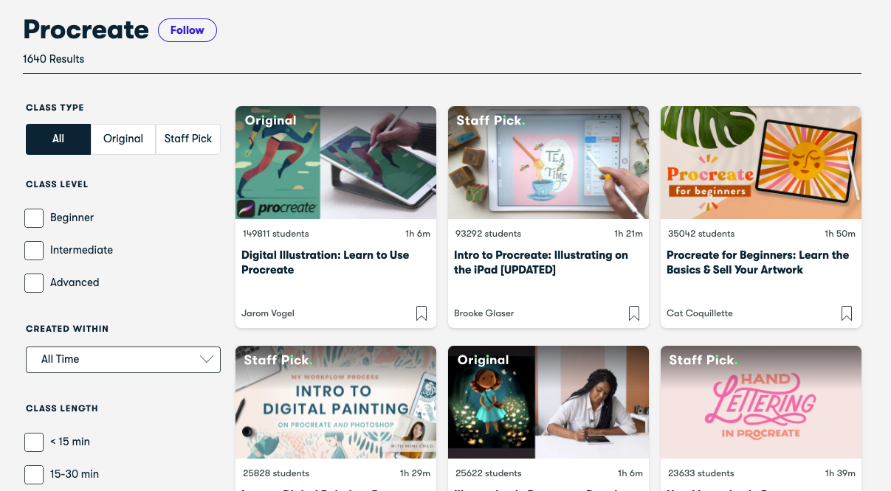
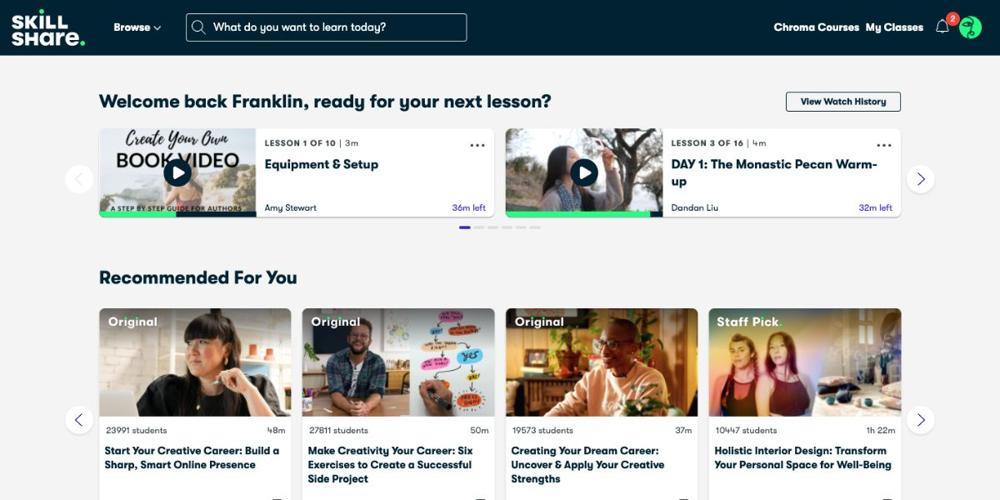
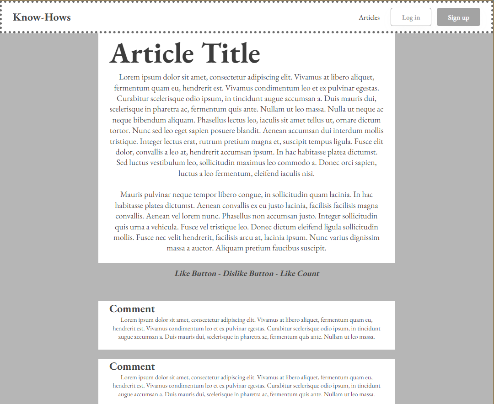

# **UI Spike**

## **Table of Contents**
- [Welke best practices in User Interface design kunnen worden toegepast om de leesbaarheid en toegankelijkheid van verschillende articles te verbeteren voor gebruikers met verschillende niveaus van digitale vaardigheden?](#hoe-beïnvloeden-ui-en-ux-design-de-algemene-gebruikservaring-in-een-web-applicatie)
    - [Wat is User Interface design?](#wat-is-user-interface-design)
    - [Waarom is UI design belangrijk in een applicatie?](#waarom-is-ui-design-belangrijk-in-een-applicatie)
    - [Welke best practices zijn er in UI design](#welke-best-practices-zijn-er-in-ui-design)
    - [Hoe kan ik deze best practices implementeren in een applicatie?](#hoe-kan-ik-deze-best-practices-implementeren-in-een-applicatie)
- [Conclusie](#conclusie)

## **Welke best practices in User Interface design kunnen worden toegepast om de leesbaarheid en toegankelijkheid van articles te verbeteren voor gebruikers met verschillende niveaus van digitale vaardigheden?**

### **Wat is User Interface design?**
User Interface design gaat over het voorspellen wat gebruikers moeten kunnen doen met je applicatie en er voor zorgen dat dit te doen is op een manier die simpel en begrijpelijk is voor de gemiddelde gebruiker zonder enige voorkennis over de applicatie. Dit wordt gedaan door een combinatie van interactie design, een doordachte volgorde voor de acties die een gebruiker kan nemen om te zorgen voor een applicatie die makkelijk te gebruiken is, visueel design, het strategisch gebruiken van fotos, kleuren en tekst om een identiteit te maken die iets toevoegt aan de applicatie, en ten slotte informatie architectuur, om de inhoud van de applicatie zo te presenteren dat gebruikers op een natuurlijke wijze deze inhoud kunnen vinden en benutten. [^1]

### **Waarom is UI design belangrijk in een applicatie?**
Hoewel het duidelijk is dat de user interface belangrijk is, is het ook goed om te begrijpen waarom dit zo is. Om dit duidelijk te maken, zullen hier een aantal redenen gediscussierd worden waarvoor UI design een grote rol speelt.

Ten eerste is de UI een van de eerste dingen die gebruikers van een applicatie zien. Het is de eerste indruk die ze krijgen, en speelt dus een grote rol in het vormen van een beeld van de applicatie. Een UI met aparte kleuren die moeilijk te navigeren is oogt onprofessioneel en is bovendien simpelweg onhandig om te gebruiken, terwijl een strakke UI ervoor zorgt dat gebruikers niet alleen met gemak de applicatie kunnen benutten, maar dat deze er ook uit ziet als een product van hoge kwaliteit.

Aansluitend op de eerste indruk is een sterke en herkenbare User Interface die past bij het beeld wat de applicatie wil creeeren een goede stap om op natuurlijke wijze gebruikers een bepaald idee te geven bij zowel de applicatie als het bedrijf waar de applicatie van is. Zo zal een bank applicatie vaak een simplistische en strak-afgewerkte UI willen om serieus maar praktisch over te komen, terwijl bijvoorbeeld een pretpark vaak fotos van mensen die het naar hun zin hebben zal willen gebruiken, en een iets lossere, gezellige sfeer voor de applicatie.

Ook zorgt een goede UI zoals eerder genoemd voor meer gemak voor de gebruiker. Een applicatie die een goed ontworpen UI bevat is een applicatie die dus gebruikersvriendelijker is, waardoor de kans hoger is dat gebruikers alle functies van de applicatie zonder moeite kunnen gebruiken en navigeren. Dit zorgt voor een app die fijn is om te gebruiken, in plaats van iets waar gebruikers mee moeten vechten om het te laten werken zoals ze verwachten of waar de meeste tijd besteed wordt door te zoeken naar wat je nodig hebt.

Ten slotte zorgt een goed ontworpen UI ervoor dat gebruikers niet alleen een beter initieel beeld vormen van de applicatie maar ook dat ze langer gebruik zullen maken ervan omdat het simpelweg werkt, en hun interesse kan houden doormiddelvan visueel aantrekkelijke elementen, weloverwogen functies en nog veel meer. Dingen die de aandacht van mensen pakken en vasthouden zoals dat zorgen ervoor dat ze de app veel gebruiken, lang gebruiken, en aan veel mensen zullen aanraden.[^2]

### **Welke best practices zijn er in UI design?**
Nu dat het beeld van User Interface Design langzaam aan vollediger begint te worden is het belangrijk om te kijken wat de standaard is binnen het veld van UI design en hoe deze bereikt kan worden.

Het is, zoals besproken was in de vorige sectie, belangrijk om een goede eerste indruk te maken, maar daarvoor moet het wel duidelijk zijn wat die indruk moet zijn, en voor wie deze bedoelt is. Het is dus extreem belangrijk dat je de eindgebruikers van je applicatie goed begrijpt voordat uberhaupt begint. Probeer te begrijpen wat ze nodig hebben, wat ze willen bereiken met de applicatie die je maakt, maar ook wat voor mensen het zijn. Hoe oud zijn je gebruikers? Waar komen ze vandaan? Hebben ze een hoge opleiding afgerond? Dit zijn allemaal dingen die mogelijk relevant zijn voor hoe je applicatie eruit moet gaan zien, want niet alles is logisch voor iedereen, maar alleen voor sommige groepen. Dit kun je onderzoeken door eindgebruikers direct te ondervragen door middel van enquites of interviews, maar ook door analyses van anderen met een soortgelijke doelgroep of observeren van hun gedrag.

Houd het overigens simpel. Er is veel om rekening mee te houden, maar dat betekent niet dat je ook elk klein detail hoeft mee te nemen in je applicatie. Vermijd onnodige elementen en functies, pak gerelateerde elementen bij elkaar en laat lege ruimte over zodat je gebruikers niet na te hoeven denken over waar ze hun aandacht moeten laten. Gebruik ook bekende en veelgebruikte symbolen op de juiste manier zodat mensen uit ervaring een idee kunnen vormen wat bepaalde dingen betekenen zonder extra uitleg. Zorg dat dingen duidelijk en concreet benoemd zijn, en als er ergens instructies worden gegeven zorg dan dat deze zo duidelijk mogelijk zijn.

Zorg dat je applicatie goed leesbaar is op verschillende apparaten, schermen en dergelijke zonder functionaliteit of visuele identiteit op te offeren. Een gebruiker moet een soortgelijke ervaring kunnen krijgen van je applicatie of dat deze nu op een telefoon of een laptop geopend wordt, of op een kleinere monitor, of misschien zelfs simpelweg een andere browser in het geval van een web applicatie. Deze keuzes moeten er namelijk niet voor zorgen dat de ervaring die een gebruiker krijgt drastisch verslechterd.

Daarnaast is kleur een heel belangrijk deel van de identiteit van je applicatie. Gebruikers zullen de kleuren van je applicatie deels koppelen aan de applicatie zelf, dus hier moet rekening mee gehouden worden op verschillende manieren. Zorg dat je niet te veel verschillende kleuren gebruikt, de volledige regenboog door je applicatie is afleidend. Gebruik dus een paar kleuren die goed met elkaar werken en gebruik deze consistent door je hele applicatie. Zorg er overigens voor dat de kleuren die je gebruikt wel te onderscheiden zijn, zelfs voor gebruikers met kleurenblindheid of andere visuele problemen. Gebruik daarnaast contrast om aandacht te trekken en leesbaarheid te verbeteren.

Zorg er ook voor dat de applicatie genoeg feedback geeft aan de gebruiker zodat ze weten als er iets gebeurt, en ook wat er gebeurt. Gebruik bijvoorbeeld icoontjes om aan te geven wanneer dingen goed gaan, of juist niet, en animaties om veranderingen duidelijk te maken. Ook geluid kan hierin een belangrijke rol spelen. Overigens is het ook erg belangrijk dat deze feedback betijds komt, duidelijk is en consistent is.[^3]

Houd er rekening mee dat fouten gemaakt kunnen worden door een gebruiker, zelfs als ze precies weten hoe een applicatie werkt, en geef ze dus een optie om fouten op te lossen of op te vangen. Als de gebruiker bijvoorbeeld posts kan maken maar niet aanpassen, geef dit dan aan en voeg een extra knop toe als extra stap om een post definitief te sturen. Maar als de post al gemaakt en gestuurd is, geef gebruikers dan nog de optie om het te verwijderen als het niet aangepast kan worden zodat ze er niet vast mee zitten.[^4]

### **Hoe kan ik deze best practices implementeren in een applicatie?**
Om alle kennis die te vinden is in dit document in praktijk te brengen is meer nodig dan alleen een lange lijst van informatie, dus om dit op te lossen volgt nu een stappenplan om een werkelijk UI design te conceptualizeren. 

#### **1. Leer je gebruikers kennen**
Zoals al eerder besproken is, is het heel belangrijk om rekening te houden met je eindgebruiker, dus de eerste stap voor het maken van een UI is om te begrijpen voor wie de UI bedoelt is. Is je doelgroep heel ervaren en kundig met technologie, of niet per se? Moet je applicatie voor heel lang op een dag gebruikt worden, of voor hooguit een paar minuten? Deze kwesties, en nog veel meer, kunnen een grote rol spelen in het ontwerp van je applicatie.

#### **2. Bepaal wat je wil bereiken**
Nu dat je weet wat je gebruikers mogelijk willen, is het belangrijk om dit te veranderen in iets waar naartoe gewerkt kan worden. Wat voor functionaliteit, identiteit en inhoud moet je applicatie hebben? Dit zorgt ervoor dat je ook werkelijk haalbare doelen hebt om naartoe te streven.

#### **3. Wireframes maken**
Met kennis over je gebruikers en je einddoelen duidelijk kun je begin met het werkelijke ontwerpen door middel van wireframes. Dit zijn simplistische schetsen die puur tonen wat de brede lijn is van het uiterlijk van je applicatie en waar bepaalde functies te vinden zijn. Daarnaast kan dit ook gebruikt worden om je ontwerp te valideren met stakeholders voordat er meer tijd in gestoken wordt.

#### **4. Visueel ontwerp**
Nadat het concept verduidelijkt is via het maken van de wireframes, is het tijd om deze iets meer te veranderen in het ideale eindproduct. Kies een kleurenpalette, wat voor lettertypes en groottes je wil gebruiken, en eventuele externe visuele elementen zoals fotos en icoontjes. Deze stap gaat vooral over het toevoegen van identiteit aan de wireframes. Ook hier wil je vaak contact opnemen met je stakeholders om te valideren en itereren.

#### **5. Prototypes**
Met een duidelijke identiteit voor je applicatie die goed uitgewerkt is, is het nu tijd voor een interactief prototype. Hiermee bepaal je een duidelijke flow voor de applicatie, hoe je bij bepaalde functionaliteiten komt en hoe ze exact zullen werken in de praktijk. Ook kun je hier zien hoe je eerdere designs er uit zullen zien in actie, en of het werkelijk zo goed werkt als het leek in de ontwerp stage. Vanaf nu kun je niet alleen je stakeholders betrekken maar ook eventueel je gebruikers.

#### **6. Testen en itereren**
Het is nu zeer belangrijk dat je je werkelijke gebruikers laat experimenteren voordat je een eindproduct gaat maken. Laat ze de prototypes uittesten en kijk waar de gebruikers op vastlopen, wat ze op een andere manier doen dan verwacht, en wat ze zeggen en denken van de prototypes. Gebruik die informatie om de prototypes te verbeteren en herhaal dat met constante verbetering tot de uitkomst goed genoeg is.

#### **7. Development handoff**
Met een definitief ontwerp is het tijd om de ontwerpen door te geven aan developers die de designs omzetten naar een echte applicatie. Deze developers hebben niet altijd even veel inzicht over wat er exact in gedachte is voor bepaalde onderdelen van het ontwerp, dus hiervoor kan wat extra documentatie handig zijn.

## **Conclusie**
De conclusie van dit onderzoek is een uitgebreid antwoord op de hoofdvraag die eerder in dit document gesteld is. Welke best practices in User Interface design kunnen worden toegepast om de leesbaarheid en toegankelijkheid van articles te verbeteren voor gebruikers met verschillende niveaus van digitale vaardigheden? Om deze vraag te beantwoorden zullen we door bepaalde stappen van de vorige sectie heenlopen en deze uitwerken.

#### **1. Leer je gebruikers kennen**
Standaard doe je dit door je gebruikers direct te ondervragen, maar voor de scope van dit project zullen we in plaats daarvan een aantal websites met soortgelijke doelgroepen zoeken en deze als algemene referentie punten gebruiken.

Ten eerste gebruiken we hiervoor Skillshare, een website met een soortgelijk doel als onze applicatie, het beschikbaar maken van informatie. Hier zullen we dus onze eerste vergelijking in trekken.

Omdat Shillshare een andere format gebruikt dan Know Hows, is hun UI ook erg anders, maar er zijn wel wat dingen uit op te halen. Zorg dat dingen die niet per se de aandacht nodig hebben maar een paar soortgelijke kleuren heeft, met een lichte en een donkere kleur voor contrast. Dit legt de focus op de dingen die echt belangrijk zijn, de 'classes' van Skillshare. Omdat dit net iets anders is dan de pagina waar dit onderzoek over gaat, is dit niet direct over te zetten, maar het helpt ons wel met ideeen van hoe er aandacht gegeven kan worden aan het artikel zelf. Een sterk contrast tussen wat het artikel is en niet om de blik van de gebruiker daar naartoe te trekken. Ditzelfde zal gedaan moeten worden met een ruimte waar gebruikers hun mening kunnen uiten, zodat ze hier niet overheen kijken en vervolgens wegklikken om terug te gaan naar de vorige pagina. Ook laat het duidelijk zien wat de meeste ruimte moet hebben, maar nog belangrijker, dat niet alle ruimte in beslag genomen hoeft te worden. In beide fotos is de ruimte die gebruikt wordt voor 'classes' waarschijnlijk niet eens 75%, met daarnaast ook wat lege ruimte om je ogen verder te sturen.

#### **2. Bepaal wat je wil bereiken**
In dit geval is er veel overlap tussen de uitwerking van dit punt en van de hoofdvraag, maar hier gaan we specifiek bepalen wat voor functies en ontwerp ideeen daarmee gaan helpen. Deze pagina hoeft gelukkig niet heel veel doen, wat helpt met het simpel houden van de pagina. Het hoeft eigenlijk maar 2 dingen te hebben. Een ruimte om een artikel te delen, en een ruimte om je mening er over te uiten. Aangezien je moeilijk een mening kunt vormen over een ongelezen artikel, zal het artikel dus altijd het eerste moeten zijn wat je ziet, en pas aan het eind van het artikel komt een plek om je mening te delen. Ook moet er natuurlijk een manier zijn om de pagina te verlaten, die ook meteen te zien moet zijn indien je op het verkeerde artikel klikt.

#### **3. Wireframes maken**
Nu dat onze functies en de belangrijke dingen duidelijk zijn, kan er een wireframe gemaakt worden wat werkt als algemene gids van hoe de pagina in elkaar steekt. Hier zal dus minder tekst zijn maar wel een wireframe-achtig eerste design.

Dit is iets complexer dan een normale wireframe, maar alsnog vrij simplistisch.

#### **4. Visueel ontwerp**
In deze stap gaan we een werkelijk beeld maken van onze pagina. Hier komen een paar extra stappen bij die bij de wireframe nog niet zo relevant waren. Ten eerste moeten we een kleuren palette bepalen. Al vrij snel kwamen we uit op blauw als hoofdkleur omdat het een rustige kleur is maar ook een die vaak gekoppeld wordt aan wijsheid of intelligentie, wat perfect is voor een applicatie over leren. We moesten echter zeker weten dat dit idee nogsteeds zou werken voor mensen die op verschillende manieren kleurenblind zijn, dus met de hulp van [DavidMathLogic.com](https://davidmathlogic.com/colorblind/#%23001B67-%23719DFF-%23FFFFFF-%23000000) konden we kijken hoe ons palette eruit zou zien voor verschillende mensen. Het resultaat daarvan is hieronder te zien.

Hier zie je links het werkelijke palette, en vervolgens hoe het eruit zou zijn voor drie verschillende soorten kleurenblindheid. Omdat we maar een enkele primaire kleur gebruiken in ons ontwerp kan het moeilijk mis gaan, wat het makkelijker maakt.

Nu dat we een palette hebben, kunnen we beginnen aan een ontwerp aan de hand van de wireframe

(De kleuren zijn als volgt van boven naar onder #001B67, #719DFF, #FFFFFF, #000000)

Het is belangrijk om hierbij te zeggen dat het palette niet helemaal goed verwerkt is vanwege eigenschappen van de software waarin het ontwerp gemaakt werd. Ook dienen de blokken met "Image" en "User" als placeholders, niet definitieve uiterlijken ervoor.

In een optimaal scenario zou zo'n eerste design gevolgd worden door heel veel itereren en testen, maar dit is helaas geen optie binnen de schaal van het onderzoek. Ook de volgende 2 stappen worden overgeslagen voor een soortgelijke reden.

#### **7. Development Handoff**
Dit design concept zal voor de laatste stap doorgegeven worden aan een andere groep, om niet alleen te kijken of het concept duidelijk is maar ook om te kijken hoe effectief de methodiek is. Deze hele sectie dient overigens ook meteen als antwoord op de hoofdvraag.

#### **Bronnen**
[^1]: Department of Health and Human Services. (n.d.). User Interface Design Basics | Usability.gov. https://www.usability.gov/what-and-why/user-interface-design.html

[^2]: AlgoRepublic. (2023, May 17). The importance of user interface design in app development. https://www.linkedin.com/pulse/importance-user-interface-design-app-development-algorepublic/

[^3]: Iqbal, A. (2023, June 16). Mastering the art of user interface Design: Essential tips and best practices. Medium. https://medium.com/@ashar.iqbal022/mastering-the-art-of-user-interface-design-essential-tips-and-best-practices-524bbddf034c

[^4]: Williams, J. M. (2023, November 21). 10 essential UI (user-interface) design tips. Webflow. https://webflow.com/blog/10-essential-ui-design-tips

[^5]: Hannah, J. (2023, November 8). A complete guide to the UI design process. UX Design Institute. https://www.uxdesigninstitute.com/blog/guide-to-the-ui-design-process/